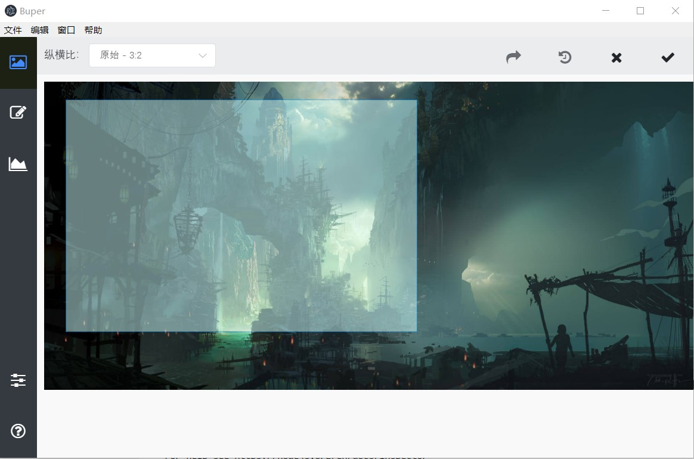

# Buper

# 批量图片裁剪工具
> A batch image cropping application.

一个偶然的情况下，由[Motrix](https://motrix.app/)接触到了[Electron](https://electronjs.org/)，惊讶于Motrix的颜值，感叹Electron技术的强大。

# 项目介绍

刚接触Electron和Vue，对其不甚了解，所以在一开始参考了Motrix（抄代码）和[Imagine](https://github.com/meowtec/Imagine)（仿界面）的很多东西。希望作者能够理解 :pray:

迄今为止，4天。借助着开发文档和Html+CSS+JS的基础，主界面已经有了雏形。

# 界面

## 相册界面

## 编辑界面

---

# 接下来的工作

## 一个bug

当相册内容为空，然后拖入图片后，相册不会显示该图片。除非打开文件对话框并加入图片，之前的图片才会显示。说明一下，拖入图片后，Vue的数据已经更新，但界面没有更新，这是问题所在。按前文的方法打开对话框并选择文件后，再拖入图片就会正常显示。在这里希望大佬可以帮忙看一下问题。

## 相册（主界面）

添加随便浏览按钮，利用爬虫获取网上（[Unsplash](https://unsplash.com/)）的图片并显示。只是为了好看。

## 编辑页面

点按编辑按钮<i class="fa fa-pencil-square-o" aria-hidden="true"></i>后，需要另起页面，载入图片并可以绘制方框以裁剪图片。

## 图表页面

以批量裁剪的数据绘制图表。（可选功能）

## 设置页面

图片处理设置相关，也可以选择要“随意浏览”的网站。

## 关于页面

关于Buper，是由batch、picture、crop三个词编出来的。

# 技术栈

+ [Electron-Vue](https://github.com/SimulatedGREG/electron-vue)
+ [Bootstrap](https://getbootstrap.com/)、[Element](http://element-cn.eleme.io/)、[Font Awesome](https://fontawesome.com/)

This project was generated with [electron-vue](https://github.com/SimulatedGREG/electron-vue)@[8fae476](https://github.com/SimulatedGREG/electron-vue/tree/8fae4763e9d225d3691b627e83b9e09b56f6c935) using [vue-cli](https://github.com/vuejs/vue-cli). Documentation about the original structure can be found [here](https://simulatedgreg.gitbooks.io/electron-vue/content/index.html).
